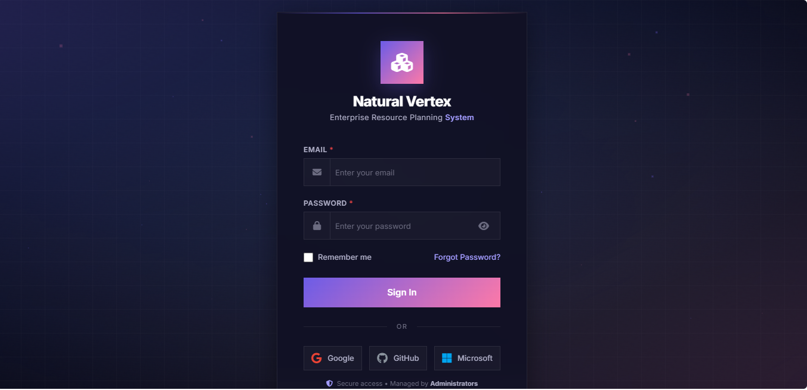
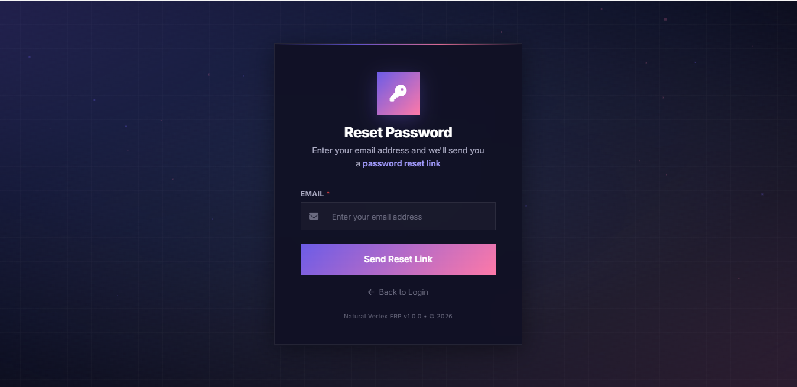
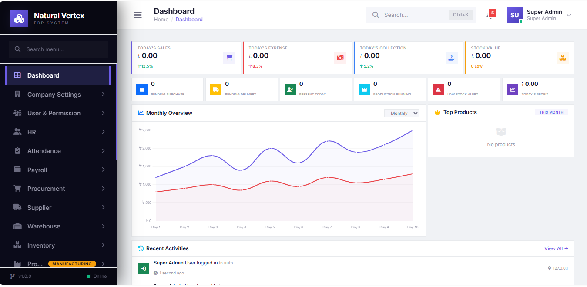

# 🏢 Natural Vertex Ltd. — ERP Management System

<p align="center">
  <strong>A modern and centralized Enterprise Resource Planning (ERP) System for Natural Vertex Ltd.</strong>
</p>

<p align="center">
  Built with Laravel, MySQL, Bootstrap, JavaScript & AJAX
</p>

---

## 📌 About the Project

**Natural Vertex Ltd. ERP Management System** is a centralized web-based business management system designed to streamline and manage the company's day-to-day operational activities from a single platform.

The system provides a structured environment for managing business operations, users, products, inventory, sales, purchases, reports and other administrative activities.

The main objective of this ERP system is to reduce manual work, improve data accuracy, centralize business information and provide management with a clear overview of organizational activities.

---

# 🖥️ System Preview

## 🔐 Login

The login interface provides secure authentication for authorized users.

<p align="center">
  
</p>

---

## 🔑 Forgot Password

Users can securely recover their account password through the password recovery system.

<p align="center">
  
</p>

---

## 📊 Dashboard

The ERP dashboard provides a centralized overview of important business information and system activities.

<p align="center">
  
</p>

---

## 📂 Sidebar Navigation

The sidebar provides quick access to different modules and features of the ERP system.

<p align="center">
  
</p>

---

# ✨ Core Features

### 🔐 Authentication & Security

* Secure user authentication
* Login and logout
* Forgot password
* Password reset
* Session management
* Role-based access control
* Permission-based module access

### 👥 User Management

* User creation
* User profile management
* User status management
* Role assignment
* Permission management

### 📦 Product Management

* Product management
* Product categories
* Product information
* Product status
* Product inventory tracking

### 📊 Inventory Management

* Stock management
* Stock availability
* Stock movement tracking
* Inventory overview
* Stock-related reports

### 🛒 Sales Management

* Sales management
* Customer information
* Sales records
* Payment status
* Sales reporting

### 📥 Purchase Management

* Purchase management
* Supplier information
* Purchase records
* Purchase tracking
* Purchase reporting

### 📈 Reports & Analytics

* Business reports
* Sales reports
* Purchase reports
* Inventory reports
* Management overview

---

# 🧩 ERP Modules

| Module                  | Description                             |
| ----------------------- | --------------------------------------- |
| 🔐 Authentication       | Login, logout & password recovery       |
| 📊 Dashboard            | Business overview and key information   |
| 👥 User Management      | Manage system users and access          |
| 📦 Product Management   | Manage products and product information |
| 🏷️ Category Management | Manage product categories               |
| 📊 Inventory            | Monitor and manage stock                |
| 🛒 Sales                | Manage sales transactions               |
| 📥 Purchases            | Manage purchase transactions            |
| 👤 Customers            | Manage customer information             |
| 🚚 Suppliers            | Manage supplier information             |
| 📈 Reports              | Generate business reports               |
| ⚙️ Settings             | Manage system configurations            |

---

# 👤 User Roles

The system follows a role-based access control structure.

### 🔴 Super Admin

Has complete access to the ERP system.

**Responsibilities:**

* Manage users
* Manage roles and permissions
* Manage system settings
* Access all modules
* View all reports

### 🟠 Admin

Manages day-to-day business operations.

**Responsibilities:**

* Manage products
* Manage inventory
* Manage sales
* Manage purchases
* Manage customers and suppliers
* View reports

### 🟢 Staff / Employee

Access is restricted according to assigned permissions.

**Responsibilities may include:**

* Data entry
* Product operations
* Inventory operations
* Sales operations
* Other assigned activities

---

# 🛠️ Technology Stack

## Backend

* **PHP**
* **Laravel 12**
* **MySQL**

## Frontend

* **HTML5**
* **CSS3**
* **Bootstrap 5**
* **JavaScript**
* **AJAX**
* **Blade Template Engine**

## Development Tools

* Git
* GitHub
* Composer
* Node.js
* NPM
* VS Code
* XAMPP

---

# 🏗️ System Architecture

The system follows the **MVC (Model-View-Controller)** architecture provided by Laravel.

```text
┌──────────────────────────────┐
│           User               │
└──────────────┬───────────────┘
               │
               ▼
┌──────────────────────────────┐
│        Web Interface         │
│   Blade + Bootstrap + JS     │
└──────────────┬───────────────┘
               │
               ▼
┌──────────────────────────────┐
│          Routes              │
│       Laravel Router         │
└──────────────┬───────────────┘
               │
               ▼
┌──────────────────────────────┐
│        Controllers           │
│      Business Logic          │
└──────────────┬───────────────┘
               │
               ▼
┌──────────────────────────────┐
│           Models             │
│       Eloquent ORM           │
└──────────────┬───────────────┘
               │
               ▼
┌──────────────────────────────┐
│           MySQL              │
│          Database            │
└──────────────────────────────┘
```

---

# 📁 Project Structure

```text
natural-vertex-erp/
│
├── app/
│   ├── Http/
│   │   ├── Controllers/
│   │   └── Middleware/
│   │
│   ├── Models/
│   └── Providers/
│
├── bootstrap/
│
├── config/
│
├── database/
│   ├── migrations/
│   ├── seeders/
│   └── factories/
│
├── public/
│   ├── css/
│   ├── js/
│   └── images/
│
├── resources/
│   ├── views/
│   ├── css/
│   └── js/
│
├── routes/
│   ├── web.php
│   └── api.php
│
├── storage/
│
├── docs/
│   └── screenshots/
│       ├── login.png
│       ├── forgot-password.png
│       ├── dashboard.png
│       ├── sidebar.png
│       └── ...
│
├── .env.example
├── artisan
├── composer.json
├── package.json
└── README.md
```

---

# ⚙️ Installation & Setup

## 1. Clone the Repository

```bash
git clone https://github.com/YOUR_USERNAME/natural-vertex-erp.git
```

Move into the project directory:

```bash
cd natural-vertex-erp
```

---

## 2. Install PHP Dependencies

```bash
composer install
```

---

## 3. Install Frontend Dependencies

```bash
npm install
```

---

## 4. Create Environment File

Copy the example environment file:

```bash
cp .env.example .env
```

For Windows:

```bash
copy .env.example .env
```

---

## 5. Generate Application Key

```bash
php artisan key:generate
```

---

# 🗄️ Database Configuration

Create a MySQL database for the project.

Then configure the `.env` file:

```env
DB_CONNECTION=mysql
DB_HOST=127.0.0.1
DB_PORT=3306
DB_DATABASE=natural_vertex_erp
DB_USERNAME=root
DB_PASSWORD=
```

Update the database credentials according to your local environment.

---

## 6. Run Database Migration

```bash
php artisan migrate
```

If seeders are available:

```bash
php artisan db:seed
```

Or:

```bash
php artisan migrate --seed
```

---

# ▶️ Run the Application

Start the Laravel development server:

```bash
php artisan serve
```

The application will normally be available at:

```text
http://127.0.0.1:8000
```

For frontend assets, run:

```bash
npm run dev
```

---

# 🔒 Security

The system is designed with security and access control in mind.

Major security considerations include:

* Authentication
* Authorization
* Role-based access control
* Permission-based access
* Password hashing
* CSRF protection
* Session management
* Server-side validation
* Input validation
* Secure database operations

> ⚠️ Never commit your `.env` file, passwords, API keys, database credentials or other sensitive information to GitHub.

---

# 📸 More System Screenshots

## 📦 Product Management

<p align="center">
  
</p>

## 📊 Inventory Management

<p align="center">
  
</p>

## 🛒 Sales Management

<p align="center">
  
</p>

## 📥 Purchase Management

<p align="center">
  
</p>

## 📈 Reports

<p align="center">
  
</p>

---

# 🚀 Future Improvements

Possible future improvements include:

* Advanced analytics dashboard
* Interactive charts
* Automated reporting
* Notification system
* Email notifications
* SMS notifications
* API integration
* Mobile-responsive improvements
* Advanced audit logging
* Backup and restore system
* Advanced permission management

---

# 🤝 Contribution

This project is developed for **Natural Vertex Ltd.**

Development and maintenance are managed according to the organization's requirements and operational needs.

---

# 📄 License

This project is proprietary software developed for **Natural Vertex Ltd.**

Unauthorized copying, distribution, modification or commercial use of this system is not permitted without proper authorization.

---

# 👨‍💻 Developer

**Shahin Hossain**

Computer Science & Engineering

GitHub: `https://github.com/shahindvlpr`

LinkedIn: `https://www.linkedin.com/in/shahindvlpr/`

---

<p align="center">
  <strong>Natural Vertex Ltd.</strong><br>
  Enterprise Resource Planning & Business Management System
</p>

<p align="center">
  Built with ❤️ using Laravel
</p>
